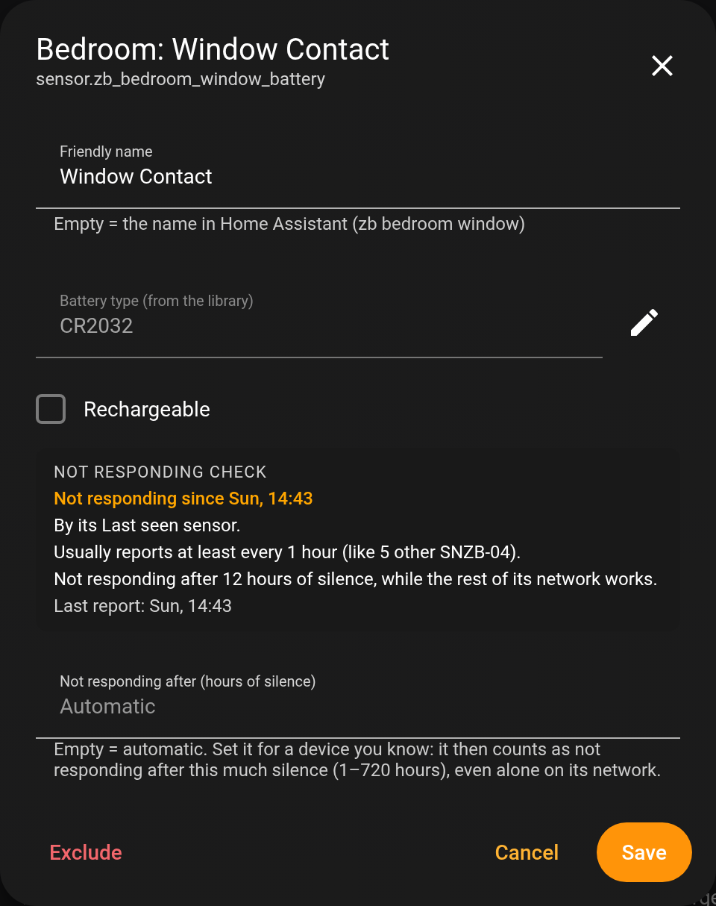

# Battery States

[](https://github.com/GGSSDD/ha-battery-states/actions/workflows/validate.yml)
[](https://github.com/GGSSDD/ha-battery-states/releases)
[](https://hacs.xyz/)
[](https://buymeacoffee.com/GGSSDD)

A Home Assistant integration that keeps an eye on all your batteries in one place.


- **A card** listing every battery with its level and battery type. Sort it, group it by area or by type, or show only the low ones.
- **Alerts** when a battery runs low, and when a device is **not responding**: silent far longer than usual for it while the rest of its network works, which usually means a dead battery. Plus an optional **reminder**.
- **Quiet hours** and a list of **recent alerts**, so you can see what was sent, held or skipped.
- **A settings page** for everything: which batteries, names, battery types, limits and alerts. No YAML.
- **Battery types filled in for you** from the [Battery Notes](https://github.com/andrew-codechimp/HA-Battery-Notes) community library, and you can correct any of them.

## Contents

- [Requirements](#requirements)
- [Installation](#installation)
- [Setup](#setup)
- [The settings page](#the-settings-page)
- [The card](#the-card)
- [Styling the card with UIX](#styling-the-card-with-uix)
- [Alerts](#alerts)
- [Not responding](#not-responding)
- [The sensors](#the-sensors)
- [Battery types](#battery-types)
- [Troubleshooting](#troubleshooting)
- [Removing](#removing)
- [Support](#support)
- [Credits and licence](#credits-and-licence)

## Requirements

- Home Assistant **2026.4.0** or newer.
- Battery sensors that report a **percentage**: sensors with the *battery* device class, as most integrations create them (Zigbee2MQTT, ZHA, Z-Wave, Matter, SwitchBot, …).

**Not supported:** sensors that only say *battery low: on/off* (binary sensors with the *battery* device class). They have no level to show or compare, so they can't be added.

## Installation

### HACS (recommended)

Until Battery States is in the HACS default store, add it as a custom repository. With [My Home Assistant](https://my.home-assistant.io/) set up, this button does it for you:

[](https://my.home-assistant.io/redirect/hacs_repository/?owner=GGSSDD&repository=ha-battery-states&category=integration)

Or by hand:

1. HACS → menu (⋮) → **Custom repositories**.
2. Repository: `https://github.com/GGSSDD/ha-battery-states`, type **Integration** → **Add**.
3. Find **Battery States** in HACS, **Download**, then restart Home Assistant.

### Manual

Copy `custom_components/battery_states` from the [latest release](https://github.com/GGSSDD/ha-battery-states/releases) into your `config/custom_components/` folder and restart Home Assistant.

## Setup

1. **Settings → Devices & services → Add integration → Battery States.**
2. Choose where the alerts go. You can change this later. Both kinds of notify targets work:
   - notify services, for example `notify.mobile_app_my_phone`;
   - notify entities, for example a phone, a Telegram chat or anything else listed as `notify.<name>`.
3. Open the settings page (**Battery States → Configure**) and pick your batteries.
4. Add the card to a dashboard (see [The card](#the-card)).

## The settings page

Open it with **Settings → Devices & services → Battery States → Configure**. It has five sections.

### Batteries


Every monitored battery, sortable by area, name or type.

- **Add battery** adds a single battery sensor.
- A device that is not responding has a **Non-responsive** badge. A line above the list tells you how many batteries can't be checked for that yet.
- Tap a battery to edit it:
  - **Name:** a friendly name. Empty means the device's name in Home Assistant.
  - **Battery type:** set or correct it. Empty means the type from the battery library.
  - **Rechargeable:** shown as *Rechargeable*; the alerts then say "recharging" instead of "replacing".
  - **Not responding check:** how this battery is checked (its Last seen sensor, its availability or any update), how often it usually reports and where that comes from, its limit, and why it can't be checked if it can't.
  - **Not responding after (hours of silence):** your own limit for this battery (1–720 hours). Empty means automatic. See [Not responding](#not-responding).
- **Remove** takes back a battery you added by hand. If a filter also finds it, it stays on the list and keeps its settings.
- **Exclude** hides a battery for good, even when a filter finds it.

### Filters

Pick batteries automatically. A battery sensor that matches **any** filter is shown, and new devices that match later are added on their own.

| Filter | Example |
| --- | --- |
| **Integrations** | *MQTT* adds every Zigbee2MQTT battery; *SwitchBot* adds all SwitchBot ones. |
| **Areas** | *Bedroom*, *Hallway*: everything with a battery in those rooms. |
| **Labels** | Give devices a label such as `battery-watch` and pick it here. |
| **Devices** | Single devices. |
| **Excluded battery sensors** | Never shown, whatever matches them. |

### Limits

- **Low battery limit** (1–99 %, default 20 %): a battery at or below this is low. It is marked `*TBR!` (to be replaced) on the card, counted and alerted.
- **Minimum silence** (1–168 hours, default 12): a device never counts as not responding sooner than this. See [Not responding](#not-responding).

### Alerts


Choose where alerts go and which ones are sent. Each section shows an example message made from one of your own batteries. See [Alerts](#alerts) for details.

### Recent alerts

The last 50 alerts and what happened to each: sent, held for quiet hours, skipped (and why), or not sent (and why, for example *doesn't exist* or *is unavailable* for a notify target). It also notes, without sending anything, when a device is responding again.

## The card

Add it from the dashboard editor (**Add card → Battery States**), or in YAML:

```yaml
type: custom:battery-states-card
```

That's all it needs. The card finds the integration's sensor by itself.

| Option | Default | Description |
| --- | --- | --- |
| `title` | `Battery States` | The card's title. |
| `collapsible` | `false` | `true`: tap the title to minimize the card to its title and summary, and tap again to expand it. |
| `load_minimized` | `false` | `true`: the card always opens minimized. It then also is collapsible (setting `collapsible: false` with it is a configuration error, since the card couldn't be expanded). |
| `entity` | found automatically | The integration's low batteries sensor. Only needed if you want to point the card at a specific sensor. |

**Example:** a card titled "Batteries" that opens minimized and expands with a tap on its title:

```yaml
type: custom:battery-states-card
title: Batteries
load_minimized: true
```

What's on it:

- **Summary**: the low batteries per battery type and the total, plus a **NON-RESPONSIVE** line while any device isn't responding.
- **Non-responsive devices**: devices that aren't responding get their own section at the top, with a battery-unknown icon, **N/A** instead of a level (the last one can't be trusted: a silent device can still say 100 %) and since when they've been silent. They're left out of the list below and the low counts until they respond again. Without grouping, the rest of the list then gets a **Devices** heading.
- **Arrow**: sort by level, ascending or descending.
- **Group by**: group by area or by battery type. The chip shows the current grouping; ✕ removes it.
- **Filter** button: show only what needs attention, i.e. the low batteries and the devices not responding.
- **Each battery**: the icon colour runs from green (full) to red (empty), with the name, battery type and level. A low battery has a battery-alert icon and the `*TBR!` mark. A battery that hasn't reported a level yet shows **—**. Tap it to open its details.

Sort, group and filter are remembered **per Home Assistant user**: the same on all your devices, and separate for each person in the household.

The card follows your theme's text, accent and error colours, so it works on light and dark themes. In a **sections** dashboard it takes the full width by default and can be made as narrow as half a column:

```yaml
type: custom:battery-states-card
grid_options:
  columns: 6
```

## Styling the card with UIX

You can restyle any part of the card with [UIX (UI eXtension)](https://uix.lf.technology), the successor of card-mod. Install UIX, then add `uix: style:` to the card:


```yaml
type: custom:battery-states-card
uix:
  style: |
    .title {
      color: var(--primary-color);
      font-weight: 500;
    }
    ha-card.summary {
      display: none;
    }
    .tbr {
      color: var(--warning-color) !important;
    }
    :host {
      --battery-states-line: transparent !important;
    }
```

**When to add `!important`:** when the card already sets that property on that element, your rule needs `!important` to win. For example, `.title` already has a font size but no colour of its own. So `color` works as is, while `font-size` needs `!important`. If a rule seems to do nothing, add `!important`.

### What you can target

| Selector | What it is |
| --- | --- |
| `ha-card.main` | The whole card |
| `.title` | The title (`.title.toggle` when it can be tapped, `.title.minimized` while minimized) |
| `ha-card.summary` | The summary box (type / count table) |
| `.controls` | The row with sort, Group by, chip and filter |
| `.sort-icon`, `.filter-icon`, `.filter-icon.on` | The sort arrow and the filter icon (`.on` while filtering) |
| `.select-anchor`, `.value` | The Group by button and its text |
| `.menu`, `.menu-item` | The Group by drop-down and its options |
| `ha-card.chip`, `.chip-name` | The grouping chip and its text |
| `.list` | The battery list |
| `ha-card.header`, `.header-text` | A group heading (area or type) |
| `ha-card.header.not-responding` | The *Non-responsive devices* heading |
| `ha-card.row` | One battery row |
| `ha-card.row.not-responding` | A row in the *Non-responsive devices* section |
| `.row-icon` | The battery icon |
| `.name`, `.label`, `.state` | The name, the battery type line and the level |
| `.since` | "since …" on a row that is not responding |
| `.tbr` | The `*TBR!` low marker |
| `tr.total`, `tr.not-responding` | The TOTAL and NON-RESPONSIVE lines of the summary |

### CSS variables

Set these on `:host` (with `!important`, since the card sets them itself):

| Variable | Default | Used for |
| --- | --- | --- |
| `--battery-states-text` | the theme's text colour | Table headings, Group by text |
| `--battery-states-text-faded` | the text colour at 50 % | Battery type line, table values, filter icon |
| `--battery-states-line` | the theme's divider colour (`--divider-color`), always at 15 % | Divider lines |
| `--battery-states-summary-border` | the theme's card border colour (`--ha-card-border-color`, else `--divider-color`), always at 50 % | The summary box border |
| `--battery-states-not-responding` | the faded text colour (`--battery-states-text-faded`) | The icon and **N/A** of a non-responsive device |

The card also uses your theme's `--accent-color` (filter on, menu hover), `--error-color` (TOTAL, `*TBR!`), `--chip-background-color` (the chip) and the usual card variables such as `--ha-card-background`.

### More examples

**Hide the summary box:**

```yaml
uix:
  style: |
    ha-card.summary { display: none; }
```

**A darker, see-through card:**

```yaml
uix:
  style: |
    ha-card.main { --ha-card-background: rgba(0, 0, 0, 0.6); }
```

**Compact rows with bigger names:**

```yaml
uix:
  style: |
    ha-card.row { height: 42px !important; }
    .name { font-size: 16px !important; }
```

**Softer secondary text, no divider lines:**

```yaml
uix:
  style: |
    :host {
      --battery-states-text-faded: var(--secondary-text-color) !important;
      --battery-states-line: transparent !important;
    }
```

**Chip in your primary colour:**

```yaml
uix:
  style: |
    ha-card.chip { background: var(--primary-color) !important; }
```

**Just the list, without sort / group / filter:**

```yaml
uix:
  style: |
    .controls { display: none !important; }
```

**Red title while anything is low** (UIX templates):

```yaml
uix:
  style: |
    .title {
      color: {{ 'var(--error-color)' if states('sensor.battery_states_low_batteries') | int(0) > 0 else 'inherit' }};
    }
```

## Alerts

All alerts have the title **Batteries**.

| Alert | When | Example |
| --- | --- | --- |
| **Low battery** | A battery drops to or below the low limit. Once per drop: it can come again after the battery was replaced or recharged. | *The battery level for the device ALARM BUTTON located in the HALLWAY, with battery type: CR2032, has dropped to 20%. Consider replacing soon!* |
| **Not responding** | A device goes silent far longer than usual for it while its network works (see [Not responding](#not-responding)). Once per silence. If it drops out again less than a day after it came back, no new alert is sent (Recent alerts still lists it). | *The device WINDOW CONTACT located in the BEDROOM, with battery type: CR2032, is not responding: no report since 4 Oct 14:43, while other SNZB-04 devices report at least every 1 hour. Last battery level: 100%. Check its battery, the device and its connection.* |
| **Reminder** | On the days and at the time you choose (default Tuesday, Thursday and Saturday at 20:00), only while at least one battery is low or a device is not responding. | *You still have 2 devices with the battery level below 20% and 1 device not responding. Check them soon!* |

Each alert can be switched off on its own.

The *not responding* message says why: *"while other SNZB-04 devices report at least every 1 hour"* (judged by its model), *"while it usually reports at least every 2 hours"* (its own rhythm), *"longer than the 24 hours you set"* (your limit), or *"unavailable since …, while other devices on its network work"*.

**Quiet hours** (off by default, e.g. 22:00–07:00): alerts that come up in this window wait until it ends. They are then sent only if they are still true: a battery that was replaced in the meantime, or a device that responded again, is skipped. A reminder due in the window is sent when it ends, with the counts at that moment.

Alerts that come up while Home Assistant is still starting wait until it has started, so notify services such as the mobile app exist. Devices aren't judged for *not responding* until Home Assistant has started.

## Not responding

A battery-powered device that dies usually just goes quiet, so its last level stays on screen. Battery States lists a device as **not responding** only when the evidence shows the problem is in **that device**: its battery, the device itself or its own connection. It must not be your network, Home Assistant, or simply a device that is quiet by nature. If that can't be shown, it doesn't guess. The device stays in the normal list, and its pop-up on the settings page says why it can't be checked.

### When a device counts as not responding

All three of these must hold:

1. **Battery States knows what's normal for it**, in this order:
   - **Your limit** for that battery (*Not responding after … hours*), if you set one.
   - **Its own steady rhythm**: once it has reported for at least 3 days, at least 10 times, on most of those days, the longest gap that keeps coming back is its normal.
   - **Other devices of the same model**: if its own reports aren't steady (often the case when it is failing), the middle value of at least 2 other monitored devices of the same model with a steady rhythm.
   - Otherwise it can't be checked.
2. **Its silence is far beyond that normal**: at least 4 times its normal longest gap, and never sooner than the *Minimum silence* setting (12 hours by default). Your own limit is used exactly as you set it.
3. **Its network demonstrably works**: another monitored device on the same integration and the same hub (e.g. the same Zigbee2MQTT bridge or ZHA coordinator) is responding normally right now. Time Home Assistant, its network or its Last seen sensor was down doesn't count as silence.

Devices **without a Last seen sensor** are judged by their integration's own verdict instead: unavailable for at least the minimum silence, while other devices on the same network are available.



The pop-up of each battery on the settings page shows its *Not responding check*: how it's heard from, what's normal for it and where that comes from, its limit, and, if it can't be checked, why.

### How the normal is kept honest

- A silence that counted as *not responding* is never learned as normal. A failing device can't teach Battery States to accept its own silence.
- The normal only goes **up** for a new rhythm that holds on 3 days in a row (or 3 silences of the same length in a week), e.g. a device you set up to report less often. Gaps that keep growing, as with a slowly dying battery, don't raise it.
- It goes **down** after a week in which the device reported more often.
- On first start it learns from your recorder's history (up to the last 14 days), so it can judge straight away. If the recorder doesn't keep those sensors, it learns as devices report: within a day for chatty devices.

### How each kind of device is heard

| Devices | How Battery States hears from them | Works out of the box? |
| --- | --- | --- |
| **Zigbee2MQTT** | The device's *Last seen* sensor, or *unavailable* with Zigbee2MQTT's Availability | After turning one on (below) |
| **ZHA** | *Unavailable*: ZHA marks battery devices unavailable after 6 hours without messages (a ZHA option) | Yes |
| **Z-Wave JS** | The device's *Last seen* sensor (created disabled: enable it) | After enabling it |
| **Matter / Thread** | *Unavailable* when the device stops responding | Yes |
| **Bluetooth** (SwitchBot, Govee, Inkbird, …) | *Unavailable* when its advertisements stop | Yes |
| **Shelly** battery devices | *Unavailable* when they miss their wake-ups | Yes |
| **Cloud integrations** (Tuya, Netatmo, Ring, …) | *Unavailable*, where the cloud reports devices offline | Usually |
| **Sleepy Bluetooth sensors** (some BTHome, Xiaomi), **ESPHome in deep sleep**, phones | Never marked unavailable: no signal | Only with your own limit (below) |

**Zigbee2MQTT settings:** turn on one of these, or both:
- **Last seen** (best): Zigbee2MQTT **Settings → Advanced → Last seen** = `ISO_8601`. Then, in Home Assistant, **enable** each device's *Last seen* entity (it's created disabled). The battery's pop-up tells you when its Last seen sensor is disabled.
- **Availability**: Zigbee2MQTT **Settings → Availability**, so that silent devices become unavailable.

### What can't be checked, and your own limit

A device can't be checked when there's no reliable evidence:
- **No normal yet:** too few reports, an irregular rhythm, and no 2 steady devices of its model.
- **Alone on its network:** no other monitored device can show that the network works.
- **No signal:** its integration never marks it unavailable and it has no Last seen sensor.

For such a device, set **Not responding after … hours** in its pop-up. You know the device, so you vouch for its rhythm: it then counts as not responding after that much silence, even alone on its network. A device without a Last seen sensor is then watched by **any update from it**, from any of its sensors.

**Example:** a sleepy Bluetooth thermometer that sends something at least every 2 hours: set *Not responding after* to 6.

### Good to know

- When a whole network goes quiet at once (a coordinator or bridge down), nobody is listed. That's a network problem, not a device problem.
- Home Assistant doesn't record which Bluetooth adapter or proxy a device is heard through. If one Bluetooth proxy dies, the devices that depended on it can be listed while others are fine. Their connection really is broken, which is why the message says "check its battery, the device and its connection".
- A device that is not responding shows **N/A** on the card instead of its last level, and isn't counted as low. The moment it responds again, it's back in the list and the counts.

## The sensors

| Sensor | State |
| --- | --- |
| `sensor.battery_states_low_batteries` | The number of low batteries among the devices that respond |
| `sensor.battery_states_not_responding` | The number of devices that are not responding (attribute `entity_ids`: their batteries) |

`sensor.battery_states_low_batteries` also holds the data the card shows:

| Attribute | Content |
| --- | --- |
| `low_threshold` | The low battery limit, in % |
| `battery_low_count` | Low batteries per battery type, e.g. `[{"CR2032": 2}, {"AAA": 0}]` |
| `not_responding_count` | Devices not responding |
| `devices` | Every battery: `entity_id`, `name`, `area`, `battery_type`, `state` (its last level as text), `value` (number), `reading` (false while no level is known), `status` (`ok`, `low` or `not_responding`), `last_report`, `not_responding_since` |

**Badges at the top of a view:**

```yaml
badges:
  - type: entity
    entity: sensor.battery_states_low_batteries
  - type: entity
    entity: sensor.battery_states_not_responding
```

**What needs attention, as a list** (Markdown card):

```yaml
type: markdown
content: |
  
  
  - **{{ d.name }}** ({{ d.area or 'no area' }}): {{ 'not responding' if d.status == 'not_responding' else d.state ~ ' %' }}
  
  All batteries are fine.
  
```

**Show the card only while something needs attention:**

```yaml
type: conditional
conditions:
  - condition: or
    conditions:
      - condition: numeric_state
        entity: sensor.battery_states_low_batteries
        above: 0
      - condition: numeric_state
        entity: sensor.battery_states_not_responding
        above: 0
card:
  type: custom:battery-states-card
```

## Battery types

Each device's battery type is looked up in the [Battery Notes](https://github.com/andrew-codechimp/HA-Battery-Notes) community library by its manufacturer and model. A copy of the library is included, and a newer one is downloaded once a week from GitHub (`raw.githubusercontent.com`). If that fails, the copy you have keeps working. Devices the library doesn't know show as *Unknown*. Set their type on the settings page, and consider adding them to the Battery Notes library so everyone benefits.

## Troubleshooting

| What you see | What to do |
| --- | --- |
| The card says **Battery States is not set up** | Add the integration (see [Setup](#setup)). |
| The card says **Entity not available: …** | The `entity` set in the card doesn't exist. Remove the option and the card finds the sensor itself. |
| A battery type is **Unknown** | The library doesn't know the device. Set the type on the settings page. |
| A device is never listed as *not responding* | Open the battery on the settings page: its *Not responding check* says how it's checked, or why it can't be. See [Not responding](#not-responding). If it says its Last seen sensor is disabled, enable that entity. |
| A device is listed as *not responding* but works | It went silent far longer than usual while its network worked. If you know it reports rarely, set its *Not responding after* limit. |
| An alert wasn't received | Check **Recent alerts** on the settings page: it says whether the alert was sent, held, skipped or not sent, and why. |
| A UIX rule does nothing | Add `!important` (see [Styling the card with UIX](#styling-the-card-with-uix)). |

The card, the settings page and the alert texts are in English.

## Removing

1. **Settings → Devices & services → Battery States → Delete.** This also removes the integration's saved data.
2. Remove the card from your dashboards.
3. Remove the integration in HACS (or delete `custom_components/battery_states`) and restart Home Assistant.

## Support

Found a bug or have an idea? [Open an issue](https://github.com/GGSSDD/ha-battery-states/issues).

If Battery States is useful to you:

<a href="https://buymeacoffee.com/GGSSDD"></a>

## Credits and licence

- Battery type library: [Battery Notes](https://github.com/andrew-codechimp/HA-Battery-Notes) by Andrew Jackson, MIT licence (see `custom_components/battery_states/library/LICENSE`).
- Battery States: MIT licence, see [LICENSE](LICENSE).
