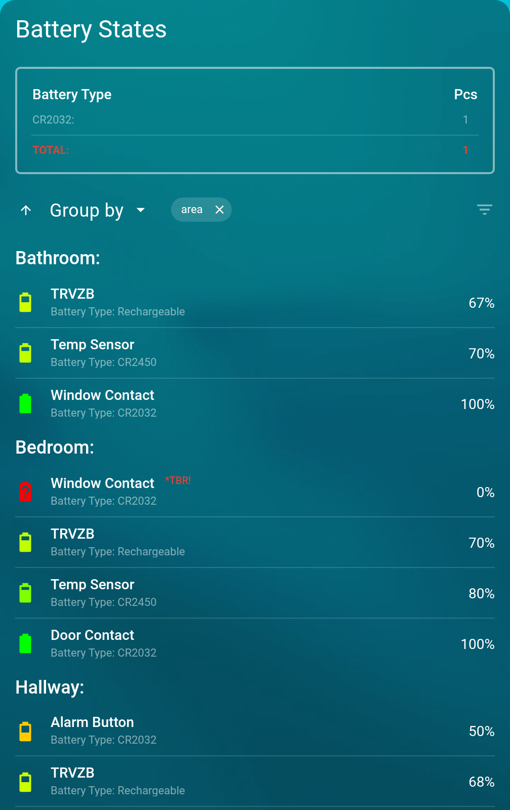
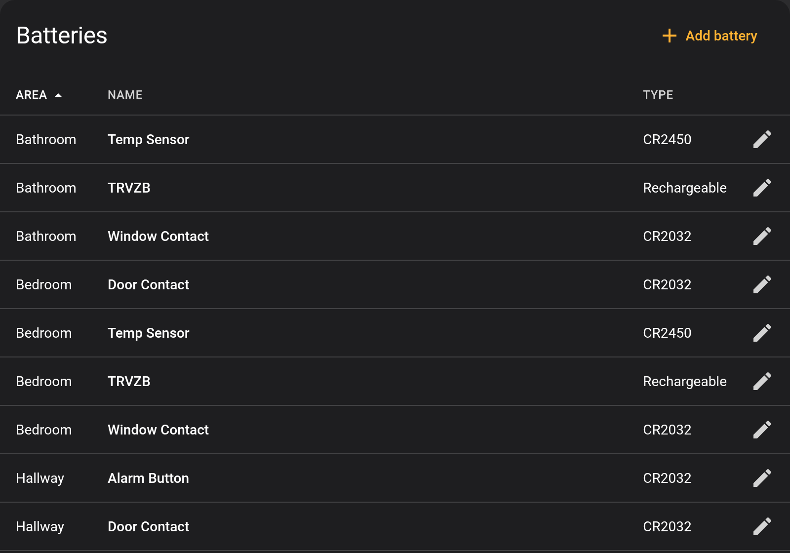
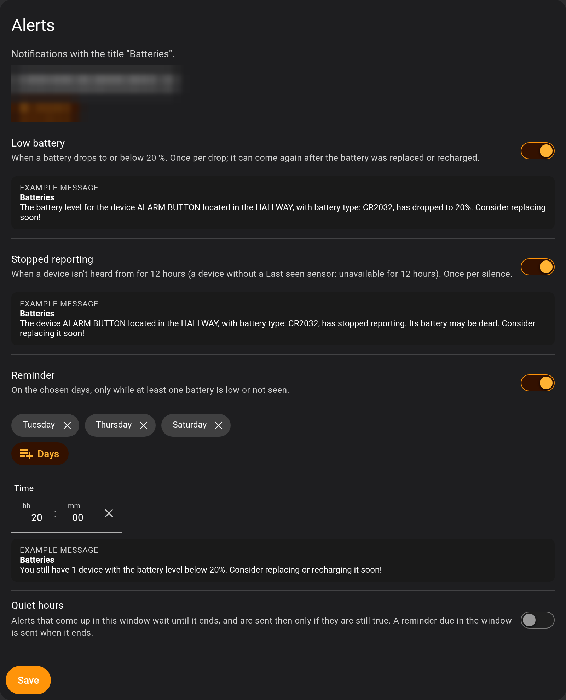
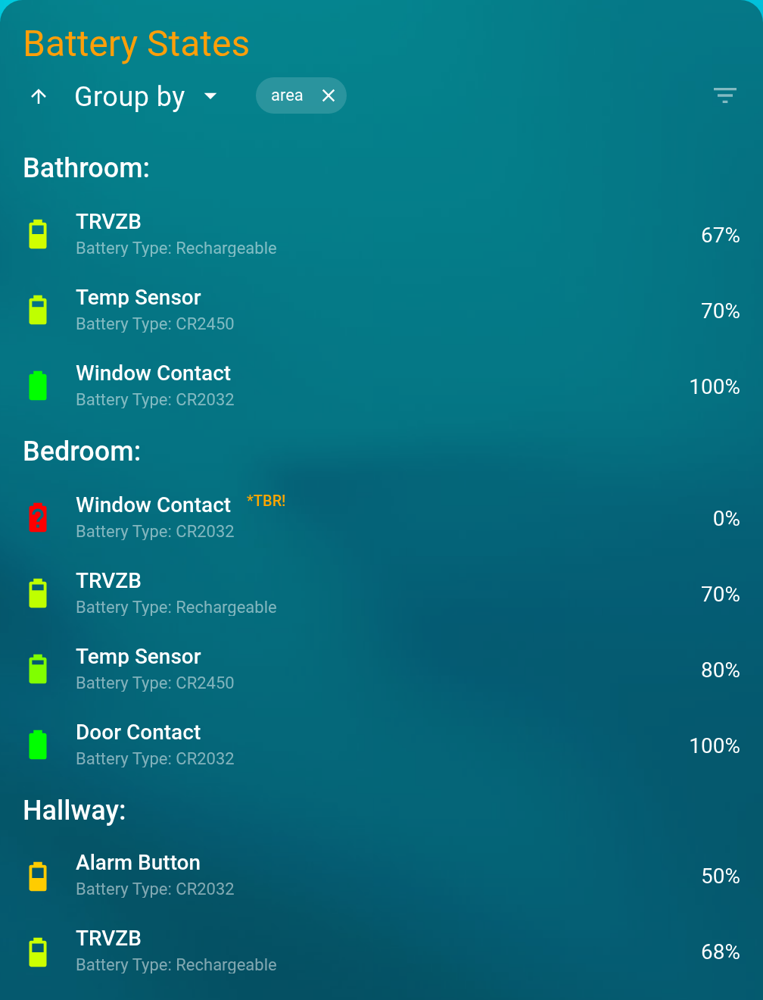

# Battery States

[](https://github.com/GGSSDD/ha-battery-states/actions/workflows/validate.yml)
[](https://github.com/GGSSDD/ha-battery-states/releases)
[](https://hacs.xyz/)
[](https://buymeacoffee.com/GGSSDD)

A Home Assistant integration that keeps an eye on all your batteries in one place.



- **A card** listing every battery with its level and battery type. Sort it, group it by area or by type, or show only the low ones.
- **Alerts** when a battery runs low or a device stops reporting (its battery may be dead), plus an optional **reminder** while anything is still low.
- **Quiet hours** and a list of **recent alerts**, so you can see what was sent, held or skipped.
- **A settings page** for everything: which batteries, names, battery types, limits and alerts. No YAML.
- **Battery types filled in for you** from the [Battery Notes](https://github.com/andrew-codechimp/HA-Battery-Notes) community library, and you can correct any of them.

## Contents

- [Requirements](#requirements)
- [Installation](#installation)
- [Setup](#setup)
- [The settings page](#the-settings-page)
- [The card](#the-card)
- [Styling the card with UIX](#styling-the-card-with-uix)
- [Alerts](#alerts)
- [Stopped reporting](#stopped-reporting)
- [The low batteries sensor](#the-low-batteries-sensor)
- [Battery types](#battery-types)
- [Troubleshooting](#troubleshooting)
- [Removing](#removing)
- [Support](#support)
- [Credits and licence](#credits-and-licence)

## Requirements

- Home Assistant **2026.4.0** or newer.
- Battery sensors that report a **percentage**: sensors with the *battery* device class, as most integrations create them (Zigbee2MQTT, ZHA, Z-Wave, Matter, SwitchBot, …).

**Not supported:** sensors that only say *battery low: on/off* (binary sensors with the *battery* device class). They have no level to show or compare, so they can't be added.

## Installation

### HACS (recommended)

Until Battery States is in the HACS default store, add it as a custom repository. With [My Home Assistant](https://my.home-assistant.io/) set up, this button does it for you:

[](https://my.home-assistant.io/redirect/hacs_repository/?owner=GGSSDD&repository=ha-battery-states&category=integration)

Or by hand:

1. HACS → menu (⋮) → **Custom repositories**.
2. Repository: `https://github.com/GGSSDD/ha-battery-states`, type **Integration** → **Add**.
3. Find **Battery States** in HACS, **Download**, then restart Home Assistant.

### Manual

Copy `custom_components/battery_states` from the [latest release](https://github.com/GGSSDD/ha-battery-states/releases) into your `config/custom_components/` folder and restart Home Assistant.

## Setup

1. **Settings → Devices & services → Add integration → Battery States.**
2. Choose where the alerts go. You can change this later. Both kinds of notify targets work:
   - notify services, for example `notify.mobile_app_my_phone`;
   - notify entities, for example a phone, a Telegram chat or anything else listed as `notify.<name>`.
3. Open the settings page (**Battery States → Configure**) and pick your batteries.
4. Add the card to a dashboard (see [The card](#the-card)).

## The settings page

Open it with **Settings → Devices & services → Battery States → Configure**. It has five sections.

### Batteries



Every monitored battery, sortable by area, name or type.

- **Add battery** adds a single battery sensor.
- Tap a battery to edit it:
  - **Name:** a friendly name. Empty means the device's name in Home Assistant.
  - **Battery type:** set or correct it. Empty means the type from the battery library.
  - **Rechargeable:** shown as *Rechargeable*; the alerts then say "recharging" instead of "replacing".
- **Remove** takes back a battery you added by hand. If a filter also finds it, it stays on the list and keeps its settings.
- **Exclude** hides a battery for good, even when a filter finds it.

### Filters

Pick batteries automatically. A battery sensor that matches **any** filter is shown, and new devices that match later are added on their own.

| Filter | Example |
| --- | --- |
| **Integrations** | *MQTT* adds every Zigbee2MQTT battery; *SwitchBot* adds all SwitchBot ones. |
| **Areas** | *Bedroom*, *Hallway*: everything with a battery in those rooms. |
| **Labels** | Give devices a label such as `battery-watch` and pick it here. |
| **Devices** | Single devices. |
| **Excluded battery sensors** | Never shown, whatever matches them. |

### Limits

- **Low battery limit** (1–99 %, default 20 %): a battery at or below this is low. It is marked `*TBR!` (to be replaced) on the card, counted and alerted.
- **Not seen after** (1–168 hours, default 12): how long a device may stay silent before it counts as *not seen*. See [Stopped reporting](#stopped-reporting).

### Alerts



Choose where alerts go and which ones are sent. Each section shows an example message made from one of your own batteries. See [Alerts](#alerts) for details.

### Recent alerts

The last 50 alerts and what happened to each: sent, held for quiet hours, skipped (and why), or not sent (and why, for example *doesn't exist* or *is unavailable* for a notify target).

## The card

Add it from the dashboard editor (**Add card → Battery States**), or in YAML:

```yaml
type: custom:battery-states-card
```

That's all it needs. The card finds the integration's sensor by itself.

| Option | Default | Description |
| --- | --- | --- |
| `entity` | found automatically | The integration's low batteries sensor. Only needed if you want to point the card at a specific sensor. |

What's on it:

- **Summary**: the low batteries per battery type, and the total.
- **Arrow**: sort by level, ascending or descending.
- **Group by**: group by area or by battery type. The chip shows the current grouping; ✕ removes it.
- **Filter** button: show only the low (or not seen) batteries.
- **Each battery**: the icon colour runs from green (full) to red (empty), with the name, battery type and level. Tap it to open its details.

Sort, group and filter are remembered **per Home Assistant user**: the same on all your devices, and separate for each person in the household.

The card follows your theme's text, accent and error colours, so it works on light and dark themes. In a **sections** dashboard it takes the full width by default and can be made as narrow as half a column:

```yaml
type: custom:battery-states-card
grid_options:
  columns: 6
```

## Styling the card with UIX

You can restyle any part of the card with [UIX (UI eXtension)](https://uix.lf.technology), the successor of card-mod. Install UIX, then add `uix: style:` to the card:



```yaml
type: custom:battery-states-card
uix:
  style: |
    .title {
      color: var(--primary-color);
      font-weight: 500;
    }
    ha-card.summary {
      display: none;
    }
    .tbr {
      color: var(--warning-color) !important;
    }
    :host {
      --bs-line: transparent !important;
    }
```

**When to add `!important`:** when the card already sets that property on that element, your rule needs `!important` to win. For example, `.title` already has a font size but no colour of its own. So `color` works as is, while `font-size` needs `!important`. If a rule seems to do nothing, add `!important`.

### What you can target

| Selector | What it is |
| --- | --- |
| `ha-card.main` | The whole card |
| `.title` | The "Battery States" title |
| `ha-card.summary` | The summary box (type / count table) |
| `.controls` | The row with sort, Group by, chip and filter |
| `.sort-icon`, `.filter-icon`, `.filter-icon.on` | The sort arrow and the filter icon (`.on` while filtering) |
| `.select-anchor`, `.value` | The Group by button and its text |
| `.menu`, `.menu-item` | The Group by drop-down and its options |
| `ha-card.chip`, `.chip-name` | The grouping chip and its text |
| `.list` | The battery list |
| `ha-card.header`, `.header-text` | A group heading (area or type) |
| `ha-card.row` | One battery row |
| `.row-icon` | The battery icon |
| `.name`, `.label`, `.state` | The name, the battery type line and the level |
| `.tbr` | The `*TBR!` low marker |

### CSS variables

Set these on `:host` (with `!important`, since the card sets them itself):

| Variable | Default | Used for |
| --- | --- | --- |
| `--bs-text` | the theme's text colour | Table headings, Group by text |
| `--bs-text-faded` | the text colour at 50 % | Battery type line, table values, summary border, filter icon |
| `--bs-line` | the text colour at 15 % | Divider lines |

The card also uses your theme's `--accent-color` (filter on, menu hover), `--error-color` (TOTAL, `*TBR!`), `--chip-background-color` (the chip) and the usual card variables such as `--ha-card-background`.

### More examples

**Hide the summary box:**

```yaml
uix:
  style: |
    ha-card.summary { display: none; }
```

**A darker, see-through card:**

```yaml
uix:
  style: |
    ha-card.main { --ha-card-background: rgba(0, 0, 0, 0.6); }
```

**Compact rows with bigger names:**

```yaml
uix:
  style: |
    ha-card.row { height: 42px !important; }
    .name { font-size: 16px !important; }
```

**Softer secondary text, no divider lines:**

```yaml
uix:
  style: |
    :host {
      --bs-text-faded: var(--secondary-text-color) !important;
      --bs-line: transparent !important;
    }
```

**Chip in your primary colour:**

```yaml
uix:
  style: |
    ha-card.chip { background: var(--primary-color) !important; }
```

**Just the list, without sort / group / filter:**

```yaml
uix:
  style: |
    .controls { display: none !important; }
```

**Red title while anything is low** (UIX templates):

```yaml
uix:
  style: |
    .title {
      color: {{ 'var(--error-color)' if states('sensor.battery_states_low_batteries') | int(0) > 0 else 'inherit' }};
    }
```

## Alerts

All alerts have the title **Batteries**.

| Alert | When | Example |
| --- | --- | --- |
| **Low battery** | A battery drops to or below the low limit. Once per drop: it can come again after the battery was replaced or recharged. | *The battery level for the device ALARM BUTTON located in the HALLWAY, with battery type: CR2032, has dropped to 20%. Consider replacing soon!* |
| **Stopped reporting** | A device goes quiet for the *Not seen after* time. Once per silence. | *The device ALARM BUTTON located in the HALLWAY, with battery type: CR2032, has stopped reporting. Its battery may be dead. Consider replacing it soon!* |
| **Reminder** | On the days and at the time you choose (default Tuesday, Thursday and Saturday at 20:00), only while at least one battery is low or not seen. | *You still have 2 devices with the battery level below 20%. Consider replacing or recharging them soon!* |

Each alert can be switched off on its own.

**Quiet hours** (off by default, e.g. 22:00–07:00): alerts that come up in this window wait until it ends. They are then sent only if they are still true: a battery that was replaced in the meantime, or a device that reported again, is skipped. A reminder due in the window is sent when it ends, with the count at that moment.

Alerts that come up while Home Assistant is still starting wait until it has started, so notify services such as the mobile app exist.

## Stopped reporting

A battery-powered device that dies usually just goes quiet, so its last level stays on screen. Battery States notices this in one of two ways:

- **The device has a Last seen sensor** (for example Zigbee2MQTT): it counts as *not seen* when it hasn't been heard from for the **Not seen after** time.
- **No Last seen sensor**: it counts as *not seen* when its battery sensor stays **unavailable** for the **Not seen after** time. A short outage, such as an integration reload, a Wi-Fi or cloud blip or a hub restart, doesn't count.

Time while Home Assistant (or, with a Last seen sensor, Zigbee2MQTT) was down is not counted as silence. A *not seen* battery shows as 0 % and counts as low.

If a device has **neither** a Last seen sensor nor ever goes unavailable, a dead battery can't be noticed. Some setups need a setting changed:

- **Zigbee2MQTT**: turn on one of these, or both:
  - **Last seen**: Zigbee2MQTT **Settings → Advanced → Last seen** = `ISO_8601`. Then, in Home Assistant, **enable** the device's *Last seen* entity (it's created disabled). The settings page tells you when a battery's Last seen sensor is disabled.
  - **Availability**: Zigbee2MQTT **Settings → Availability**, so that silent devices become unavailable.
- **ZHA**: battery-powered devices become unavailable after a set time without messages (a ZHA option), so this works without changes.

## The low batteries sensor

`sensor.battery_states_low_batteries` holds the number of low (or not seen) batteries. Use it for a badge, a conditional card or your own automations.

| Attribute | Content |
| --- | --- |
| `low_threshold` | The low battery limit, in % |
| `battery_low_count` | Low batteries per battery type, e.g. `[{"CR2032": 2}, {"AAA": 0}]` |
| `devices` | Every battery: `entity_id`, `name`, `area`, `battery_type`, `state` (text), `value` (number), `reading` (false when there is no real reading), `not_seen` |

**Badge at the top of a view:**

```yaml
badges:
  - type: entity
    entity: sensor.battery_states_low_batteries
```

**The low batteries as a list** (Markdown card):

```yaml
type: markdown
content: |
  
  
  
  - **{{ d.name }}** ({{ d.area or 'no area' }}): {{ 'not seen' if d.not_seen else d.state ~ ' %' }}
  
  All batteries are fine.
  
```

**Show the card only while something is low:**

```yaml
type: conditional
conditions:
  - condition: numeric_state
    entity: sensor.battery_states_low_batteries
    above: 0
card:
  type: custom:battery-states-card
```

## Battery types

Each device's battery type is looked up in the [Battery Notes](https://github.com/andrew-codechimp/HA-Battery-Notes) community library by its manufacturer and model. A copy of the library is included, and a newer one is downloaded once a week from GitHub (`raw.githubusercontent.com`). If that fails, the copy you have keeps working. Devices the library doesn't know show as *Unknown*. Set their type on the settings page, and consider adding them to the Battery Notes library so everyone benefits.

## Troubleshooting

| What you see | What to do |
| --- | --- |
| The card says **Battery States is not set up** | Add the integration (see [Setup](#setup)). |
| The card says **Entity not available: …** | The `entity` set in the card doesn't exist. Remove the option and the card finds the sensor itself. |
| A battery type is **Unknown** | The library doesn't know the device. Set the type on the settings page. |
| A battery never shows *not seen* | See [Stopped reporting](#stopped-reporting). If the edit pop-up says *Not-seen check off: its Last seen sensor is disabled*, enable that entity. |
| An alert wasn't received | Check **Recent alerts** on the settings page: it says whether the alert was sent, held, skipped or not sent, and why. |
| A UIX rule does nothing | Add `!important` (see [Styling the card with UIX](#styling-the-card-with-uix)). |

The card, the settings page and the alert texts are in English.

## Removing

1. **Settings → Devices & services → Battery States → Delete.** This also removes the integration's saved data.
2. Remove the card from your dashboards.
3. Remove the integration in HACS (or delete `custom_components/battery_states`) and restart Home Assistant.

## Support

Found a bug or have an idea? [Open an issue](https://github.com/GGSSDD/ha-battery-states/issues).

If Battery States is useful to you:

<a href="https://buymeacoffee.com/GGSSDD"></a>

## Credits and licence

- Battery type library: [Battery Notes](https://github.com/andrew-codechimp/HA-Battery-Notes) by Andrew Jackson, MIT licence (see `custom_components/battery_states/library/LICENSE`).
- Battery States: MIT licence, see [LICENSE](LICENSE).
